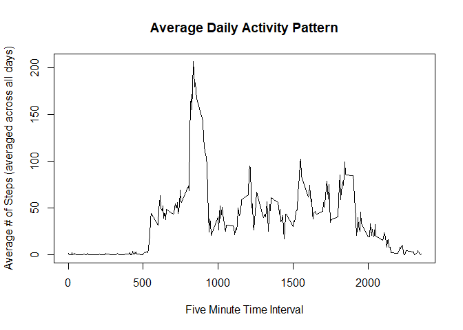

## Loading and preprocessing the data
Let's load the data into R using read.csv.

```r
data <- read.csv('./activity.csv', header = TRUE, na.strings = "NA")
```

Next, let's convert the date column to a date class 

```r
data$date <- as.Date(data$date, format = "%Y-%m-%d")
```

## What is mean total number of steps taken per day?
To calculate the total number of steps taken per day, we will use the group_by and summarize functions in the dplyr package. 

```r
library(dplyr)
sum.per.day <- data %>% group_by(date) %>% summarise(sum = sum(steps))
sum.per.day
```

```
## # A tibble: 61 x 2
##    date         sum
##    <date>     <int>
##  1 2012-10-01    NA
##  2 2012-10-02   126
##  3 2012-10-03 11352
##  4 2012-10-04 12116
##  5 2012-10-05 13294
##  6 2012-10-06 15420
##  7 2012-10-07 11015
##  8 2012-10-08    NA
##  9 2012-10-09 12811
## 10 2012-10-10  9900
## # ... with 51 more rows
```

Next, we'll plot a histogram of the total number of steps taken per day 

```r
hist(sum.per.day$sum, breaks = seq(0, 25000, 2500), main = 'Total Number of Steps per Day', xlab = 'Number of Steps')
```

<!-- -->

Here is the mean total number of steps taken per day 

```r
mean(sum.per.day$sum, na.rm = TRUE)
```

```
## [1] 10766.19
```

Here is the median total number of steps taken per day 

```r
median(sum.per.day$sum, na.rm = TRUE)
```

```
## [1] 10765
```


## What is the average daily activity pattern?
First, we'll calculate the average number of steps taken across each interval using group_by and summarize 

```r
avg.per.interval <- data %>% group_by(interval) %>% summarise(avg = mean(steps, na.rm = TRUE))
```

```
## `summarise()` ungrouping output (override with `.groups` argument)
```

Next, we'll make a time-series plot of the five minute interval (x-axis) and the average number of steps taken, averaged across all days (y-axis)

```r
with(avg.per.interval, plot(interval, avg, type = "l", main = "Average Daily Activity Pattern", xlab = "Five Minute Time Interval", ylab = "Average # of Steps (averaged across all days)"))
```

<!-- -->

Next, we'll find which 5-minute interval, on average across all the days in the dataset, contains the maximum number of steps

```r
avg.per.interval[which.max(avg.per.interval$avg), ]$interval
```

```
## [1] 835
```

## Imputing missing values
First, we'll calculate and report the total number of missing values in the dataset

```r
sum(is.na(data$steps))
```

```
## [1] 2304
```

Strategy for Filling in Missing Values in the Dataset:  
Missing values in the dataset will be equal to the mean steps for that particular interval

Create a new dataset that is equal to the original dataset but with the missing values filled in  
To create the new dataset, we'll use a for loop and an if statement. For each row in the data frame, we'll look to see if the steps value is NA. If it is NA, we'll determine the interval that corresponds to that row, then set the steps value equal to the average steps value for that particular interval 

```r
for (i in 1:nrow(data)){
  if (is.na(data[i,]$steps)) {
    int <- data[i,]$interval
    data[i,]$steps <- avg.per.interval[match(int,avg.per.interval$interval), ]$avg
  }
}
head(data)
```

```
##       steps       date interval
## 1 1.7169811 2012-10-01        0
## 2 0.3396226 2012-10-01        5
## 3 0.1320755 2012-10-01       10
## 4 0.1509434 2012-10-01       15
## 5 0.0754717 2012-10-01       20
## 6 2.0943396 2012-10-01       25
```

Make a histogram of the total number of steps taken each day 

```r
sum.per.day <- data %>% group_by(date) %>% summarise(sum = sum(steps))
```

```
## `summarise()` ungrouping output (override with `.groups` argument)
```

```r
hist(sum.per.day$sum, breaks = seq(0, 25000, 2500), main = 'Total Number of Steps per Day', xlab = 'Number of Steps')
```

<!-- -->

Calculate and report the mean and median total number of steps taken per day 

Here is the mean total number of steps taken per day 

```r
mean(sum.per.day$sum, na.rm = TRUE)
```

```
## [1] 10766.19
```

Here is the median total number of steps taken per day 

```r
median(sum.per.day$sum, na.rm = TRUE)
```

```
## [1] 10766.19
```

Do these values differ from the estimates from the first part of the assignment? What is the impact of imputing missing data on the estimates of the total number of daily steps?  
The values differ very slightly from the first part of the assignment. The frequency of the total number of steps between 10000 - 12500 increases by about 10, otherwise values stay close to the same.  
The mean stayed exactly the same. 
The median increased slightly, which makes sense given the increase in frequency between 10000 - 12500 steps 

## Are there differences in activity patterns between weekdays and weekends?
Create a new factor variable in the dataset with two levels, weekday & weekend. 

```r
weekend <- c("Saturday", "Sunday")
data$day <- factor((weekdays(data$date) %in% weekend), levels = c(TRUE,  FALSE), labels = c("weekend", "weekday"))
```

Make a panel plot containing a time series plot (type = 'l') of the 5 minute intervals (x-axis) and the average number of steps taken, averaged across all weekdays and all weekends (y-axis)

```r
avg.per.interval.day <- data %>% group_by(interval, day) %>% summarise(avg = mean(steps))
```

```
## `summarise()` regrouping output by 'interval' (override with `.groups` argument)
```

```r
avg.weekend <- avg.per.interval.day[avg.per.interval.day$day == "weekend", ]
avg.weekday <- avg.per.interval.day[avg.per.interval.day$day == "weekday", ]

par(mfrow = c(2,1))
plot(avg.weekday$interval, avg.weekday$avg, type = "l", main = "Weekday", xlab = "Five Minute Time Interval", ylab = "Avg # Steps")
plot(avg.weekend$interval, avg.weekend$avg, type = "l", main = "Weekend", xlab = "Five Minute Time Interval", ylab = "Avg # Steps")
```

<!-- -->
